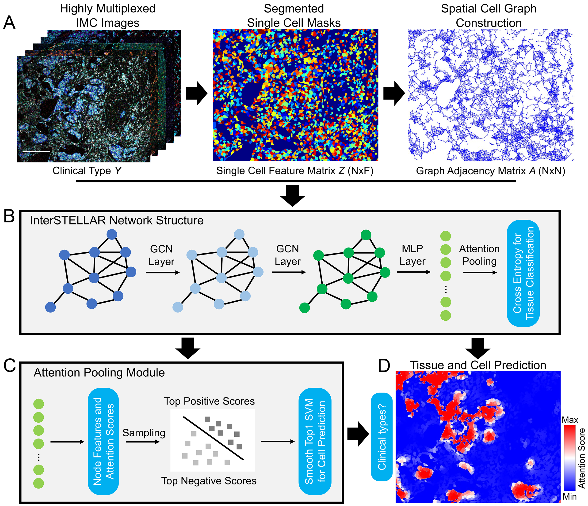

# Interpretable spatial cell learning enhances the characterization of patient tissue microenvironments with highly multiplexed imaging data



In highly multiplexed imaging data analysis, there is a gap between tissue phenotype identification and its relevant microenvironment characterization. Here we present **InterSTELLAR**, a geometric deep learning framework for multiplexed imaging data, to directly link tissue-scale outcomes with the corresponding cell communities that are clinically relevant. Using a publicly available breast cancer imaging mass cytometry dataset, InterSTELLAR allows simultaneous tissue phenotype prediction and interested community detection, with better performance than reference methods. Downstream analyses demonstrate InterSTELLAR is able to capture specific microenvironment features from different clinical cancer subtypes, as well as discover potential relationships to patient prognosis. InterSTELLAR represents an application of geometric deep learning with direct benefits for extracting enhanced microenvironment characterization for multiplexed imaging of patient samples.

## Contents

- [Directory structure of InterSTELLAR](#directory-structure-of-interstellar)
- [Customize environment for InterSTELLAR](#customize-environment-for-interstellar)
  - [Our InterSTELLAR environment](#our-interstellar-environment)
  - [Installation](#installation)
- [Implement InterSTELLAR](#implement-interstellar)
  - [Download example data](#download-example-data)
  - [Implement InterSTELLAR with scripts](#implement-interstellar-with-scripts)
- [Contact](#contact)
- [References](#references)

## Directory structure of InterSTELLAR
```
InterSTELLAR
|---InterSTELLAR
|---|---Graph_Construction_Functions.py
|---|---InterSTELLAR_Network.py
|---|---InterSTELLAR_Train.py
|---|---InterSTELLAR_Utility.py
|---Demo
|---|---Graph_Construction_Demo.py
|---|---Training_DeepSNiF_script.py
|---|---InterSTELLAR_Train_Demo.py
|---|---InterSTELLAR_Predict_Demo.py
|---trained_weights
|---|---trained_weights_10fold
|---|---trained_weights_ETA
```

## Customize environment for InterSTELLAR
### Suggested InterSTELLAR environment
- Windows 10 64bit
- Python 3.7
- PyTorch 1.12.1
- PyTorch-Geometric 2.2.0
- NVIDIA GPU + CUDA
- Note that Linux also works with such configurations

### Installation
- Create a virtual environment and install PyTorch and PyTorch_Geometric (we run all the codes in a Anaconda Powershell Prompt):
```
$ conda create -n 'InterSTELLAR' python=3.7
$ conda activate InterSTELLAR (some systems recommend: source activate IMC_Denoise)
```
- Install the PyTorch package (version 1.12.1) from https://pytorch.org/get-started/previous-versions
- Install the PyTorch-Geometric package from https://github.com/pyg-team/pytorch_geometric#installation
- Download and install the topk package from https://github.com/oval-group/smooth-topk
- Download the source code and install the package in your folder:
```
$ git clone https://github.com/PENGLU-WashU/InterSTELLAR.git
$ cd InterSTELLAR
$ pip install -e .
```

## Implement InterSTELLAR
### Download example data
- Please go to https://doi.org/10.5281/zenodo.7527814 and download **graph_data.npy**. 
- Previously trained weights can be accessed in this repository.
### Hyper-parameters used in this package
| Parameter          | Description                                                                                                                                                                                                                       | Default Value | Data type |
|--------------------|-----------------------------------------------------------------------------------------------------------------------------------------------------------------------------------------------------------------------------------|---------------|-----------|
| dataset       | The dataset used to build graphs from raw data. npy format, along with its folder.                                                                                                                                                | graph_data.npy             | str       |
| neighbour_thresh             | The thresh value used to determine if any two cells are neighbours.       | 40             | int       |
| myeps  | The value used in log transform of the cell data.         | 1e-4             | float       |
| built_graph_data       | The built graphs from raw data. npy format, along with its folder. | constructed_graph_data.npy           | str     |
| fold_order      | 10-fold cross validation, specify the fold order, from 1 to 10.                    | 5           | int       |
| k_sample_val   | k top highest and lowest samples in cell-scale training.   | 8           | int       |
| epoch_num          | The epoch number  | 30          | int     |
| lr   | Initial training rate.             | 3e-4          | float     |
| eta | The eta value in the loss function, between 0 and 1    | 0.85       | float     |
| n_classes    | The number of tissue classes | 3          | int     |
| out_channels    | The output channel number | 10          | int     |
| batch_size    | The batch size | 8          | int     |
| lambda_reg    | l1 regularization parameter for network weights | 3e-5         | float     |
| results_dir    | The folder to save the trained weights | None          | str     |
| GPU    | Apply GPU for training | True         | bool     |
| trained_weights    | Load a trained weights file to model | N/A          | str     |
| save_results    | Save the predicted tissue and cell-scale results | False         | bool     |

### Implement InterSTELLAR with scripts
- Activate the InterSTELLAR environment.
  ```
  $ conda activate InterSTELLAR
  ```
- Graph construction from raw data.
  ```
  $ python Demo/Graph_Construction_Demo.py --dataset 'graph_data.npy' --neighbour_thresh '40' --myeps '1e-4'  --built_graph_data 'constructed_graph_data.npy' 
  ```
- InterSTELLAR training with the demo data.
  ```
  $ python Demo/InterSTELLAR_Train_Demo.py --dataset 'constructed_graph_data.npy' --fold_order '5' --k_sample_val '8' --epoch_num '30' --lr '3e-4' --eta '0.85' --n_classes '3' --out_channels '10' --batch_size '8' --lambda_reg '3e-5' --results_dir 'saved_model_interstellar5.pt' --GPU 'True'
  ```
- InterSTELLAR prediction with the test dataset from the demo data.
  ```
  $ python Demo/InterSTELLAR_Predict_Demo.py --trained_weights 'saved_model_interstellar5.pt' --dataset 'constructed_graph_data.npy' --n_classes '3' --out_channels '10' --GPU 'True' --save_results 'True'
  ```   

## Contact

Peng Lu - [@penglu10](https://twitter.com/penglu10) - penglu@wustl.edu
<br/>Project Link: [https://github.com/PENGLU-WashU/InterSTELLAR](https://github.com/PENGLU-WashU/InterSTELLAR)
<br/>Lab Website: [Thorek Lab WashU](https://sites.wustl.edu/thoreklab/)

## References

If you find our work useful in your research or if you use parts of this code please consider citing our [paper](https://www.biorxiv.org/content/early/2023/03/28/2023.03.26.534306):

Lu P, Oetjen K, Oh S and Thorek D. Interpretable spatial cell learning enhances the characterization of patient tissue microenvironments with highly multiplexed imaging data. bioRxiv, 2023. https://www.biorxiv.org/content/early/2023/03/28/2023.03.26.534306

```
@article{lu2023interpretable,
  title={Interpretable spatial cell learning enhances the characterization of patient tissue microenvironments with highly multiplexed imaging data},
  author={Lu, Peng and Oetjen, Karolyn and Oh, Stephen and Thorek, Daniel LJ},
  journal={bioRxiv},
  pages={2023--03},
  year={2023},
  publisher={Cold Spring Harbor Laboratory}
}
```
